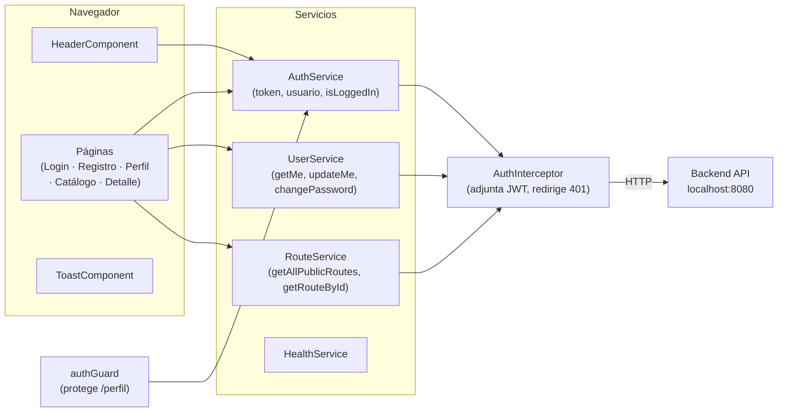

# FusaRoute Frontend

Interfaz web para el sistema de información de transporte público de Fusagasugá.
Proyecto Integrador de Ingeniería de Software I, Universidad de Cundinamarca.

## Stack

| | Versión |
|---|---|
| Angular | **21** (zoneless — sin zone.js) |
| TypeScript | 5.9 |
| Node.js | 22 LTS |
| PWA | `@angular/service-worker` |
| Test runner | Vitest (vía `@angular/build:unit-test`) |

Se arranca en la versión vigente de cada herramienta, no en una anterior. Un salto de
versión mayor es una decisión propia, con su tarjeta; no se hace a mitad de sprint.

## Requisitos

- **Node.js ≥ 22.12** (LTS). Si se usa `nvm`: `nvm use` lee el `.nvmrc`.
- Backend corriendo en `http://localhost:8080` (ver el README del backend).

## Instalación y ejecución (ambiente DEV)

```bash
npm ci
cp .env.example .env      # y llenarlo
npm start                 # http://localhost:4200
```

`npm start` levanta el frontend contra el backend en `http://localhost:8080`, que es lo que
declara `src/environments/environment.ts`. El backend tiene que estar corriendo aparte.

## Producción

| | |
|---|---|
| Frontend | [`https://fusaroute.vercel.app`](https://fusaroute.vercel.app) (Vercel, build de `main`) |
| Backend | `https://fusaroute-backend.onrender.com` (Render, tier gratis) |

`environment.prod.ts` compila la URL del backend **dentro** del bundle en tiempo de build —
no hay variables de entorno en Vercel que leer ni que configurar. El `CORS_ALLOWED_ORIGINS`
del backend en Render debe incluir el dominio de Vercel para que las peticiones no den `403`.

**Cold start:** el backend duerme tras ~15 min de inactividad en el tier gratis de Render; el
primer request tras eso puede tardar hasta ~60 s.

### Verificación rápida

```bash
npm ci              # instalar dependencias
npx ng build        # compilar (debe salir sin errores)
npx ng test         # ejecutar los tests (Vitest)
```

## Arquitectura



### ¿Por qué signals y no zone.js?

Angular 21 corre en modo **zoneless** por defecto: no hay `zone.js` que detecte cambios
automáticamente tras un evento asíncrono. Los componentes usan `signal()` y `computed()`
para que Angular sepa qué cambió y cuándo re-renderizar. Sin signals, un error asignado
a una variable normal después de un `subscribe()` no se refleja en la vista — el error
queda "invisible", que es justamente el bug que se corrigió en login, registro y health-check.

### Interceptor de autenticación

El interceptor (`core/interceptors/auth.interceptor.ts`) adjunta el header
`Authorization: Bearer <token>` a cada petición HTTP, con dos excepciones:

1. **No adjunta token en `/api/auth/**`**: evita que un token vencido en localStorage
   provoque un 401 espurio al intentar registrarse o iniciar sesión.
2. **No redirige al login en 401 de rutas de auth**: un 401 en `/api/auth/login` es
   "credenciales incorrectas", no "sesión expirada" — se muestra el error, no se redirige.

## Pantallas

| Ruta | Componente | Auth requerida |
|---|---|---|
| `/rutas` | RoutesListComponent | No |
| `/rutas/:id` | RoutesDetailComponent | No |
| `/registro` | RegisterComponent | No |
| `/login` | LoginComponent | No |
| `/perfil` | ProfileComponent | Sí (authGuard) |
| `/health` | HealthCheckComponent | No |

## PWA

La aplicación es instalable desde el navegador («Añadir a pantalla de inicio»), sin pasar por
Play Store ni App Store. El service worker **está desactivado en `ng serve`** a propósito;
para probar la instalación hay que servir el build:

```bash
ng build
npx http-server -p 8081 -c-1 dist/fusaroute-frontend/browser
```

Solo funciona sobre HTTPS o sobre `localhost` — es una regla del navegador. Y ojo: el service
worker hace que **la app cargue** sin red; **no** es el modo offline del requisito, que es un
endpoint del backend que calcula la ruta por distancia sobre los GeoJSON.

## Seguridad

**Ninguna clave secreta va en este repositorio.** Todo lo que se compila en Angular viaja al
navegador y es inspeccionable; los secretos viven solo en el backend. `.env.example` está
versionado con los valores vacíos y es la lista de las variables que existen.

## Troubleshooting

| Problema | Solución |
|---|---|
| Puerto 4200 ocupado | `npx ng serve --port 4201` |
| Token vencido y la app no carga | Limpiar localStorage: `localStorage.clear()` en la consola del navegador, recargar |
| `npm ci` falla por peer deps | El `.npmrc` ya tiene `legacy-peer-deps=true` — si se borró, recrearlo |
| Los mensajes de error no se ven | Verificar que el componente use `signal()`, no una variable normal (Angular 21 es zoneless) |
